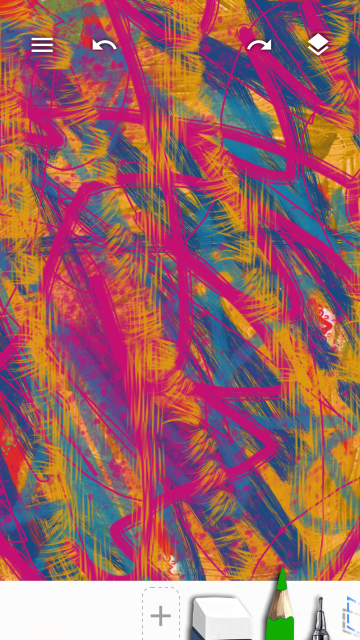

## Toolbox

The toolbox will expand if you drag it up or tap on the focused tool.

There are three levels of expansion. Drag up on the toolbox all the way to show it fully. The Toolbox will collapse once it looses focus.

## Layers

Tap the Layers button in the top right to show all the layers in the file.

The Layer action button appears when you long press a layer.
You can select multiple layers while the action buttons/menu is active.
You can also move the layer(s) by dragging it through the stack.

You access this menu by tapping the more actions (`...`) button.

Layer properties can be accessed either by tapping on the focused layer or via Layers Menu > Layer Properties.

## Dialogs

The paint menu will appear on clicking the hamburger button in the top left.

The brush setting appear upon tapping a focused brush in the toolbox.

Brush selection screen shows up when you add a new brush.