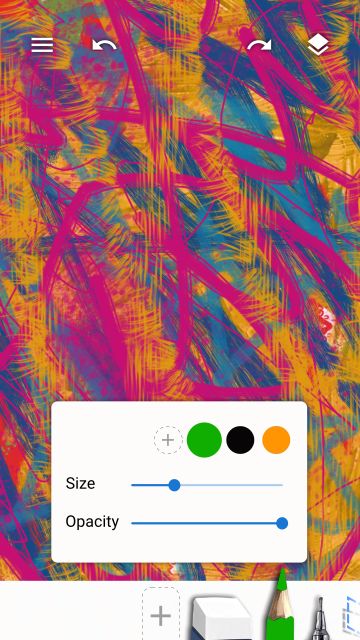
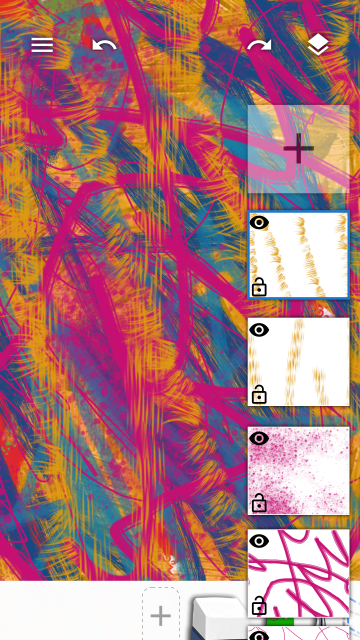

## Toolbox

Swipe left on the Toolbox to view next page of tools (or right to view previous page of tools).

Tap the focused tool to open the Quick Settings for that tool.

Long press a tool in the toolbox to edit the tool. (change brush, change tool settings, remove brush)

When in selection mode, tap the other tools to add to selection.

## Layers

Tap the Layers button in the top right to show all the layers in the file.

Same at the Tools you can select multiple layers when in selection mode.

Layer properties can be accessed either by tapping on the focused layer or via Layers Menu > Layer Properties.

## Dialogs

The paint menu will appear on clicking the hamburger button in the top left.

## Tool Settings

Placeholder Text

The brush settings appear when you tap on the focused brush in the toolbox or when you long press the brush and tap the brush settings button.

Here, you can select from a list of predefined Brush Dynamics, create a new one, copy delete, or edit.

Here you can select a input ( like `Pen Pressure`) or starting function (like `randomNumber`) and tranform it with the a function (like `linearCurve`) and set the `Brush Tip Size`.

Tap on a transform Function to open it's widget and change values.

Brush selection screen shows up when add a new brush or when you long press a brush and tap on the brush select button.