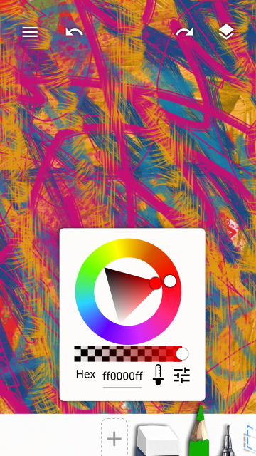
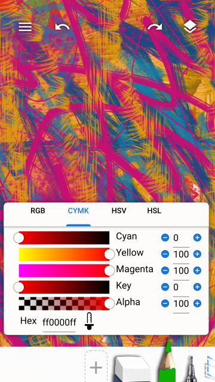

## Toolbox

Swipe left on the Toolbox to view next page of tools (or right to view previous page of tools).

Tap the focused tool to open the Quick Settings for that tool.

Tap a focused color or the + icon to open the color selector.

Tap settings icon to open up the color levels dialog for more control over colors.

Long press a tool in the toolbox to edit the tool. (change brush, change tool settings, remove brush)

When in selection mode, tap the other tools to add to selection.

## Layers

Tap the Layers button in the top right to show all the layers in the file.

Same at the Tools you can select multiple layers when in selection mode.

Layer properties can be accessed either by tapping on the focused layer or via Layers Menu > Layer Properties.

## Dialogs

The paint menu will appear on clicking the hamburger button in the top left.

## Tool Settings

The brush settings appear when you tap on the focused brush in the toolbox or when you long press the brush and tap the brush settings button.

When editing brush settings a stroke of the brush is rendered.

Tap the squiggle icon to open the scratchpad. So you can test the brush while editing it.

*The bottom of the pixel brush settings*

Part of the Brush Settings is Brush Dynamics. You can select from a list of predefined dynamics or create a custom dynamics preset.

Long press to trigger selection mode.

Here you add Paint Options. (Pressing the "+" button.)

Here you add Dynamic Inputs. (Pressing the "+" button.

Editing Dynamic Input.

Select a Curve.

Edit a Curve.

Brush selection screen shows up when add a new brush or when you long press a brush and tap on the brush select button.

Long press to trigger selection mode.